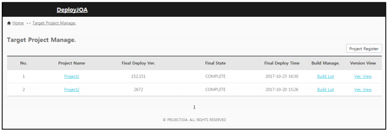
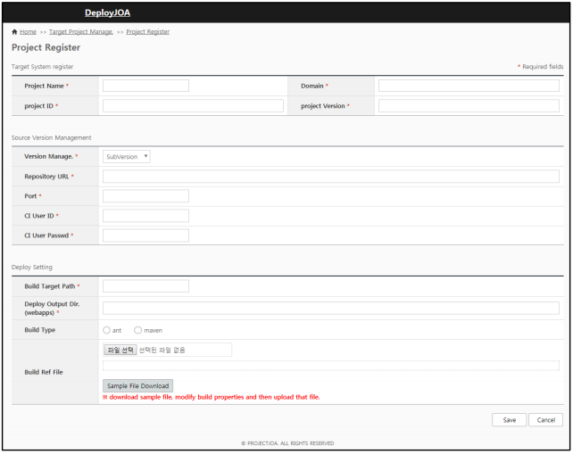
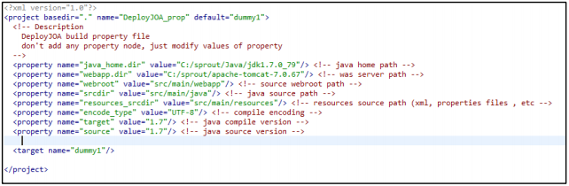
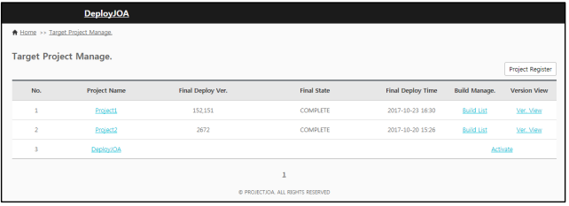
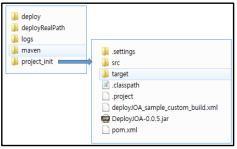
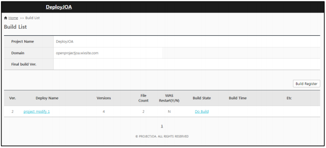
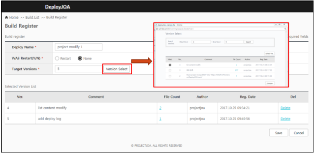
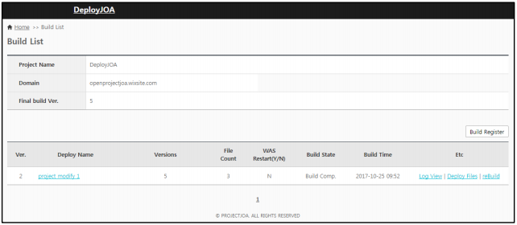

# deployJOA
 Java Build Personal Project

## Overview
 This is Java Build Control tools. It supports web application build and deploying.

## Specification
 - Only Java project
 - Java 1.7 or later
 - Ant or Maven Project

 ## NOTICE
 - Not support total source project files but support partial revision file build and deploying.
 - If you want to deploy total source files, use the initial generated files (After project Activation)
 
 ## HOW TO INSTALL
 - Download DeployJOA-beta.war
 - Download Apache-Tomcat.7 (or later)
 - Unzip DeployJOA-beta.war and then put unzipped files to Apache-Tomcat.7/webapps/ROOT
 - Modify D:\apache-tomcat-7.0.82\webapps\ROOT\WEB-INF\classes\config\props\hsqldb.properties
  - Globals.hsqldb.file=D:/apache-tomcat-7.0.82/webapps/ROOT/WEB-INF/classes/db/deployjoa_db.sql
  - Globals.hsqldb.port=9002
 - Start Apache-Tomcat.7
 
 ### Guide1.1 Project List
 
 
 
 - Project Registered (Button): Configuring project
 - Project Name (List item) : Configuring registered project.
 - Build Manage.(List item) : Go to build managing page.
 - Versions View(List item) : Go to version list page connected by SVN
 
 ### Guide1.2 Project Configuration
 
 
 
 Configuring a project for build control. Project Information, SVN URL, Build information
 Target System Register
 - Project Name : Input a project Name shown in project list page.
 - Domain : Input used domain for this project.
 - Project ID : Input the project id for Build Control. If it is maven project, input the artifactId value in pom.xml
 - Project Version : Input the project version (ex : 1.0.0). If it is maven project, input the version value in pom.xml

 Source Version Management
 - Version Manage. : Supporting Only SVN.
 - Repository URL : Input SVN Project URL. 
 - Port (Optional) : Input SVN Service Port.
 - CI User ID : Input SVN User ID.
 - CI User Passwd : Input SVN User Passwd.
 
 Deploying Setting
 - Build Target Path : Input build target base directory path.
 - Deploy Output Dir. : Input output directory paty after version build.
 - Build Type : Choose build type , Ant or Maven Builder.
                (If Maven Builder, it should be deployed as a war file)
 - Build Ref File : Attach a build reference file.
                    Download a sample file and then modify that file, and upload the modified sample file.

 

 Description of Build Ref File.
 
 - Java_home.dir : Java Home path or java path for Build.
 - webapp.dir : Web Application Server path (ex : tomcat service path )
 - srcdir : java source path
 - resources_srcdir : resource directory path
 - encode_type : encoding type for build. (ex : UTF-8)
 - target : java version for generated .class file compatibility.
 - source : java version for source compatibility.

 ### Guide1.3 Project Activation
 
 
 
 This step is activating the registered project.
 - Activate : get source files from SVN Repository than perform initial compilation.
              The project source files is added and compiled files are generated in Build Target Path.
 
 
 
 - Build List : Go to target SVN version list page for compilation
 - Ver. View : Go to SVN Revision list page.
 
 ### Guide2.1 Build List
 
 
 
 This is build list page for compiling selected revisions.
 - Build Register (Button) : Go to revision select page to compile.
 - Deploy Name : Build Title
 - Versions : selected SVN Revisions.
 - File Count : selected source file count
 - WAS Restart(Y/N) :
 - Build Status : It shows build version status. (Do Build, ReBuild, Build Comp)
                  Do Build – wait on building
                  ReBuild – wait on re-building
                  Build Comp – build compelete
 - Build Time : If build version is complete, the build time is shown.
 
 ### Guide2.2 Build Register
 
 
 
 This is SVN Revision select page for partial compilation.
 - Deploy Name : Input Build Title.
 - WAS Restart(Y/N) : Was Restart need or not in deploying build version files
 - Target Versions : selected SVN Revisions.
 - Ver. (List Item) : SVN Revision.
 - Comment (List Item) : SVN Revision comment.
 - File Count (List Item) : source file count of the revision.
 - Del (List Item) : Delete the revision from build version.
 
 ### Guide2.3 Partial Build and download generated files.
 
 
 
 Refer to Guide2.1 Build List. If the build is complete, Log View|Deploy files|rebuild buttons is shown.
 - Log View : show the compile system log.
 - Deploy File : download generated files of the build version.
 - rebuild : compile again.
 